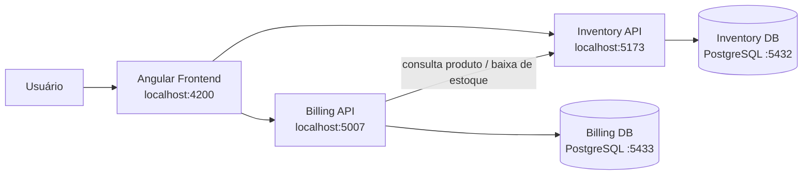

# Sistema de Emissão de Notas Fiscais

Projeto desenvolvido como teste técnico para a Korp. A solução implementa cadastro de produtos, controle de estoque e emissão/impressão de notas fiscais com fechamento integrado ao estoque.

## Visão geral

A aplicação é dividida em dois serviços de backend e um frontend Angular:

- **Inventory API**: cadastro de produtos e controle de estoque.
- **Billing API**: criação de notas fiscais, gerenciamento de itens e fechamento da nota.
- **Frontend**: interface para produtos, notas fiscais e fluxo de impressão/emissão.
- **PostgreSQL**: um banco independente para cada API.



## Tecnologias

### Backend

- C# / .NET 8
- ASP.NET Core Web API
- Entity Framework Core
- PostgreSQL
- Swagger / OpenAPI
- xUnit

### Frontend

- Angular 21
- Angular Material
- RxJS
- Vitest

### Infraestrutura

- Docker
- Docker Compose
- Nginx para servir o frontend no container

## Estrutura do projeto

```text
.
├── backend/
│   ├── Inventory.Api/
│   └── Billing.Api/
├── frontend/
├── tests/
│   ├── Inventory.Api.Tests/
│   └── Billing.Api.Tests/
├── .env.example
├── docker-compose.yml
└── Korp_Teste_GuilhermeBaeta.sln
```

## Regras de negócio implementadas

- O código do produto deve ser único.
- O estoque inicial não pode ser negativo.
- Cada nota é criada com status **Open**.
- A numeração segue o formato `NF-AAAA-000001`, com sequência anual.
- Um mesmo produto não pode ser adicionado duas vezes à mesma nota.
- Itens só podem ser adicionados, alterados ou removidos enquanto a nota estiver aberta.
- Uma nota precisa ter pelo menos um item para ser impressa/fechada.
- Ao imprimir a nota, o frontend exibe indicador de processamento e solicita o fechamento à Billing API.
- A Billing API solicita a baixa de estoque à Inventory API.
- A baixa só é concluída quando há estoque suficiente para todos os produtos solicitados.
- A nota só é marcada como **Closed** depois que a Inventory API confirma a baixa de estoque.
- Após a confirmação, o frontend atualiza o status e abre a impressão do navegador.
- Notas fechadas não podem ser emitidas novamente pelo fluxo de impressão.
- O fechamento é definitivo no fluxo atual da aplicação.

## Detalhamento técnico

O documento solicitado no desafio, com ciclos de vida do Angular, RxJS, bibliotecas, componentes visuais, frameworks C#, tratamento de erros, LINQ, microsserviços, persistência, concorrência, testes e decisões arquiteturais está disponível em:

**[docs/detalhamento-tecnico.md](docs/detalhamento-tecnico.md)**

## Executando com Docker

Esta é a forma mais simples de executar a solução completa.

### Pré-requisito

- Docker Desktop ou ambiente com Docker Compose disponível.

Na raiz do projeto, crie o arquivo local de variáveis de ambiente a partir do exemplo:

```powershell
Copy-Item .env.example .env
```

O arquivo `.env` não é versionado. Ajuste as credenciais locais se necessário e então suba a aplicação:

```bash
docker compose up --build -d
```

Verifique os containers:

```bash
docker compose ps
```

Os serviços possuem health checks no Docker Compose. A Billing API aguarda a Inventory API ficar saudável, e o frontend aguarda as duas APIs antes de iniciar. No `docker compose ps`, os containers devem aparecer com estado `healthy` após a inicialização.

A aplicação ficará disponível em:

| Serviço | URL |
| --- | --- |
| Frontend | http://localhost:4200 |
| Inventory API | http://localhost:5173 |
| Inventory Health | http://localhost:5173/health |
| Inventory Swagger | http://localhost:5173/swagger |
| Billing API | http://localhost:5007 |
| Billing Health | http://localhost:5007/health |
| Billing Swagger | http://localhost:5007/swagger |
| Inventory PostgreSQL | localhost:5432 |
| Billing PostgreSQL | localhost:5433 |

As migrations do Entity Framework são aplicadas automaticamente quando cada API inicia.

Para acompanhar os logs:

```bash
docker compose logs -f inventory-api billing-api frontend
```

Para encerrar os containers:

```bash
docker compose down
```

Para remover também os volumes e recriar os bancos do zero:

```bash
docker compose down -v
```

## Executando localmente

### Pré-requisitos

- .NET SDK 8.0.422 ou patch compatível com o `global.json`.
- PostgreSQL, ou Docker para subir apenas os bancos.
- Node.js e npm compatíveis com Angular 21.

### 1. Subir os bancos

Na raiz do projeto, caso ainda não exista um `.env` local:

```powershell
Copy-Item .env.example .env
```

Depois:

```bash
docker compose up -d inventory-db billing-db
```

### 2. Inventory API

Em um terminal:

```bash
dotnet run --project backend/Inventory.Api/Inventory.Api.csproj
```

Disponível em `http://localhost:5173`.

### 3. Billing API

Em outro terminal:

```bash
dotnet run --project backend/Billing.Api/Billing.Api.csproj
```

Disponível em `http://localhost:5007`.

### 4. Frontend

Em outro terminal:

```bash
cd frontend
npm install
npm start
```

Disponível em `http://localhost:4200`.

## Build e testes

### Backend

Na raiz do projeto:

```bash
dotnet restore
dotnet build Korp_Teste_GuilhermeBaeta.sln
dotnet test Korp_Teste_GuilhermeBaeta.sln
```

Os testes de backend cobrem regras dos serviços de produtos, itens da nota e fechamento da nota, incluindo a integração HTTP simulada entre Billing e Inventory.

### Frontend

Na pasta `frontend`:

```bash
npm install
npm run build
npm test -- --watch=false
```

Os testes de frontend validam as chamadas HTTP dos serviços responsáveis por produtos e notas fiscais.

## Verificação completa da entrega

Na raiz do projeto, o script `scripts/verify.ps1` executa em sequência as verificações usadas antes da entrega: restore, build e testes do backend, instalação determinística, build e testes do frontend e validação da configuração do Docker Compose.

```powershell
.\scripts\verify.ps1
```

Para executar apenas as validações de código e testes, sem validar o Docker Compose:

```powershell
.\scripts\verify.ps1 -SkipDockerValidation
```

A validação do Compose utiliza `.env.example`, portanto não depende das credenciais do arquivo `.env` local. O script encerra imediatamente caso qualquer etapa retorne erro.

## Health checks

As duas APIs expõem um endpoint simples de saúde para facilitar diagnóstico local, monitoramento e validações de infraestrutura:

```text
GET http://localhost:5173/health
GET http://localhost:5007/health
```

Quando a aplicação está disponível, o endpoint responde com status HTTP `200` e o estado `Healthy`.

## Principais endpoints

### Inventory API

| Método | Endpoint | Descrição |
| --- | --- | --- |
| `POST` | `/api/products` | Cadastra um produto |
| `GET` | `/api/products` | Lista os produtos |
| `GET` | `/api/products/{id}` | Consulta um produto por ID |
| `POST` | `/api/products/deduct-stock` | Realiza baixa de estoque |

### Billing API

| Método | Endpoint | Descrição |
| --- | --- | --- |
| `POST` | `/api/invoices` | Cria uma nota fiscal |
| `GET` | `/api/invoices` | Lista as notas fiscais |
| `GET` | `/api/invoices/{id}` | Consulta uma nota por ID |
| `POST` | `/api/invoices/{id}/close` | Conclui a emissão, solicita a baixa de estoque e fecha a nota |
| `GET` | `/api/invoices/{invoiceId}/items` | Lista os itens da nota |
| `POST` | `/api/invoices/{invoiceId}/items` | Adiciona um item |
| `PUT` | `/api/invoices/{invoiceId}/items/{itemId}` | Altera a quantidade de um item |
| `DELETE` | `/api/invoices/{invoiceId}/items/{itemId}` | Remove um item |

## Tratamento de erros

As APIs utilizam respostas padronizadas para erros de validação e regras de negócio. Quando aplicável, a resposta contém:

```json
{
  "statusCode": 400,
  "message": "Descrição do erro.",
  "traceId": "identificador-da-requisicao"
}
```

Entre os cenários tratados estão produto inexistente, código duplicado, estoque insuficiente, nota inexistente, alteração de nota já fechada e indisponibilidade da Inventory API.

## Fluxo principal

1. Cadastrar produtos e seus estoques.
2. Criar uma nova nota fiscal.
3. Adicionar produtos à nota e definir as quantidades.
4. Alterar ou remover itens enquanto a nota estiver aberta.
5. Clicar em **Imprimir nota**.
6. Durante o processamento, a Billing API solicita a baixa de estoque à Inventory API.
7. Com a baixa confirmada, a nota passa para **Closed**.
8. O frontend atualiza o status e abre o diálogo de impressão do navegador.

## Observações de arquitetura

Cada serviço possui seu próprio banco de dados, mantendo separadas as responsabilidades de estoque e faturamento. A comunicação entre Billing e Inventory é HTTP síncrona e encapsulada no `InventoryApiClient`.

A solução prioriza simplicidade e clareza para o escopo do teste técnico. Em um cenário de produção com maior volume e requisitos de resiliência, a integração entre serviços poderia evoluir para mecanismos de mensageria, idempotência e consistência eventual.
