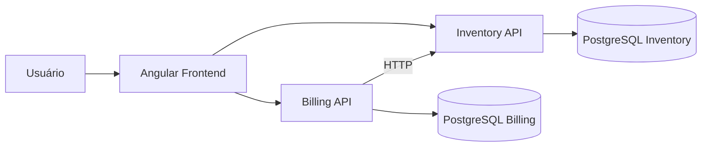

# Detalhamento Técnico — Sistema de Emissão de Notas Fiscais

## 1. Objetivo da solução

A solução foi desenvolvida para atender ao teste técnico de emissão de notas fiscais, contemplando cadastro de produtos, controle de estoque, criação de notas fiscais com numeração sequencial, inclusão de múltiplos produtos, impressão/emissão da nota, baixa de estoque e tratamento de falhas entre microsserviços.

A arquitetura utiliza um frontend Angular e dois microsserviços independentes em C#/.NET, cada um com seu próprio banco PostgreSQL:

- **Inventory API**: responsável pelo cadastro de produtos e controle de saldo em estoque.
- **Billing API**: responsável pela criação de notas fiscais, itens, numeração sequencial e fechamento da nota.
- **Frontend Angular**: interface para cadastro, consulta, edição dos itens e impressão/emissão da nota fiscal.



## 2. Tecnologias e bibliotecas utilizadas

### 2.1 Frontend

| Tecnologia / biblioteca | Finalidade |
| --- | --- |
| Angular 21 | Framework principal do frontend. |
| Angular Router | Navegação entre Produtos, Notas Fiscais e Detalhes da Nota. As páginas são carregadas com `loadComponent`, utilizando lazy loading. |
| Angular Forms | Reactive Forms no cadastro de produtos e inclusão de itens; `ngModel` é usado apenas na edição inline da quantidade de um item. |
| Angular HttpClient | Comunicação HTTP com Inventory API e Billing API. |
| Angular Material | Componentes visuais como botões, cards, campos, selects, tabelas, spinners, toolbar e snackbars. |
| RxJS 7.8 | Fluxos assíncronos das requisições HTTP, composição de chamadas e controle de estados de carregamento. |
| Vitest | Execução dos testes unitários do frontend. |
| jsdom | Ambiente DOM usado pelos testes do frontend. |
| TypeScript | Linguagem utilizada no frontend. |

### 2.2 Componentes visuais

A biblioteca visual utilizada é **Angular Material**. Entre os módulos usados estão:

- `MatButtonModule`;
- `MatCardModule`;
- `MatFormFieldModule`;
- `MatInputModule`;
- `MatSelectModule`;
- `MatTableModule`;
- `MatProgressSpinnerModule`;
- `MatSnackBarModule`;
- `MatToolbarModule`.

Além do Angular Material, foram criados estilos SCSS próprios para layout, estados visuais, responsividade e impressão com `@media print`.

### 2.3 Backend

| Tecnologia / biblioteca | Finalidade |
| --- | --- |
| C# / .NET 8 | Plataforma e linguagem do backend. |
| ASP.NET Core Web API | Framework HTTP utilizado nos dois microsserviços. |
| Entity Framework Core | ORM e acesso a dados. |
| Npgsql.EntityFrameworkCore.PostgreSQL | Provider do EF Core para PostgreSQL. |
| PostgreSQL 17 | Persistência física dos dados. |
| Swashbuckle / Swagger | Documentação e exploração dos endpoints em ambiente de desenvolvimento. |
| xUnit | Testes unitários dos serviços do backend. |
| EF Core InMemory | Banco em memória utilizado exclusivamente nos testes unitários. Não é utilizado pela aplicação em execução. |

### 2.4 Golang

**Golang não foi utilizado nesta solução.** Portanto, o item de gerenciamento de dependências em Golang não se aplica. O backend foi desenvolvido integralmente em C#/.NET.

## 3. Ciclos de vida do Angular utilizados

Foi utilizado o ciclo de vida **`OnInit`**, por meio da implementação da interface `OnInit` e do método `ngOnInit()`.

Ele é usado em três páginas:

- `ProductsPage`: carrega a lista inicial de produtos;
- `InvoicesPage`: carrega a lista inicial de notas fiscais;
- `InvoiceDetailsPage`: lê o identificador da rota e carrega nota, itens e produtos necessários para a tela.

Exemplo conceitual:

```typescript
export class ProductsPage implements OnInit {
  ngOnInit(): void {
    this.loadProducts();
  }
}
```

Não foi necessário utilizar `OnDestroy`, `AfterViewInit` ou outros hooks. As chamadas feitas pelo `HttpClient` retornam Observables finitos que completam após a resposta HTTP, e não existem subscriptions permanentes ou listeners manuais que exijam limpeza no ciclo de destruição do componente.

## 4. Uso de RxJS

Sim, a solução utiliza RxJS.

### `Observable`

Os serviços HTTP retornam `Observable<T>`, por exemplo ao listar produtos, criar notas ou adicionar itens. Isso mantém a integração alinhada ao modelo assíncrono do `HttpClient` do Angular.

### `finalize`

O operador `finalize()` é utilizado para restaurar estados de interface mesmo quando uma requisição termina com erro. Exemplos de estados controlados:

- `loading`;
- `saving`;
- `creating`;
- `printing`.

Isso evita que spinners ou botões permaneçam travados após uma falha HTTP.

### `forkJoin`

Na página de detalhes da nota, `forkJoin()` executa em paralelo três chamadas independentes:

- consulta da nota;
- consulta dos itens;
- consulta dos produtos.

A tela só é preenchida quando todas as respostas necessárias são concluídas.

## 5. Organização do frontend

O frontend foi organizado em:

- `core/models`: contratos TypeScript utilizados pelas APIs;
- `core/services`: serviços HTTP de produtos e notas;
- `pages/products`: cadastro e listagem de produtos;
- `pages/invoices`: criação e listagem das notas;
- `pages/invoice-details`: inclusão/edição de itens e impressão da nota;
- `app.routes.ts`: configuração de rotas e lazy loading das páginas.

Os componentes são standalone, importando apenas os módulos utilizados por cada página.

## 6. Fluxo de impressão e fechamento da nota

A impressão é a operação que conclui a emissão da nota fiscal.

Fluxo implementado:

1. A nota deve estar com status **Aberta**.
2. A nota deve possuir pelo menos um item.
3. O usuário clica em **Imprimir nota**.
4. É exibida uma confirmação informando que o processo é definitivo e fará a baixa do estoque.
5. Durante a requisição, o botão apresenta **Processando impressão...** com indicador de carregamento.
6. O frontend chama `POST /api/invoices/{id}/close` na Billing API.
7. A Billing API monta a requisição de baixa a partir dos itens da nota.
8. A Billing API chama `POST /api/products/deduct-stock` na Inventory API.
9. Se toda a baixa for confirmada, a Billing API altera o status para **Closed** e grava `ClosedAt`.
10. O frontend atualiza a nota para **Fechada** e abre `window.print()`.
11. O CSS de impressão remove navegação, formulários e ações, mantendo os dados relevantes da nota e seus produtos.

Uma nota já fechada não pode ser impressa novamente pelo fluxo de emissão: o botão permanece visível, porém desabilitado e identificado como **Nota já fechada**.

## 7. Arquitetura de microsserviços

O requisito mínimo de dois microsserviços foi atendido com aplicações ASP.NET Core separadas.

### Inventory API

Responsabilidades:

- cadastrar produtos;
- listar e consultar produtos;
- garantir código único;
- controlar saldo;
- executar baixa atômica de estoque.

Possui banco próprio: **Inventory PostgreSQL**.

### Billing API

Responsabilidades:

- criar notas fiscais;
- gerar numeração sequencial;
- listar e consultar notas;
- adicionar, alterar e remover itens de notas abertas;
- solicitar informações de produtos à Inventory API;
- solicitar baixa de estoque;
- fechar a nota somente após confirmação da Inventory API.

Possui banco próprio: **Billing PostgreSQL**.

### Comunicação entre serviços

A Billing API não acessa diretamente o banco de estoque. A comunicação é feita via HTTP por `InventoryApiClient`, configurado por `HttpClient` tipado e injeção de dependência.

Essa separação preserva a responsabilidade e o banco de dados de cada microsserviço.

## 8. Persistência real e banco de dados

A aplicação usa **PostgreSQL** em execução real. O Docker Compose cria dois containers independentes:

- `inventory-db`, exposto localmente na porta `5432`;
- `billing-db`, exposto localmente na porta `5433`.

Os bancos possuem volumes Docker próprios (`inventory_data` e `billing_data`), portanto os dados permanecem fisicamente persistidos mesmo após reiniciar os containers, desde que os volumes não sejam removidos.

O Entity Framework Core é utilizado para mapeamento e migrations. Na inicialização de cada API é executado `Database.Migrate()`, garantindo que migrations pendentes sejam aplicadas automaticamente.

## 9. Numeração sequencial das notas

A nota é criada inicialmente como **Open** e recebe numeração no formato:

```text
NF-AAAA-000001
```

A sequência é controlada pela tabela `invoice_number_sequences`.

Para gerar o próximo número foi utilizado um comando PostgreSQL com `INSERT ... ON CONFLICT ... DO UPDATE ... RETURNING`, executado dentro de transação. Isso evita depender de uma simples consulta de `MAX + 1`, que seria vulnerável a concorrência.

A sequência é independente por ano.

## 10. Tratamento de erros e exceções no backend

Os dois microsserviços utilizam um **middleware global de exceções**, `GlobalExceptionMiddleware`.

A resposta de erro segue um formato padronizado:

```json
{
  "statusCode": 400,
  "message": "Descrição do erro.",
  "traceId": "identificador-da-requisicao"
}
```

O `traceId` permite correlacionar a resposta apresentada ao cliente com logs do servidor.

### Mapeamentos principais

| Exceção / cenário | HTTP |
| --- | ---: |
| `ArgumentException` / requisição inválida | `400 Bad Request` |
| `KeyNotFoundException` | `404 Not Found` |
| `InvalidOperationException` / conflito de regra de negócio | `409 Conflict` |
| `InventoryUnavailableException` na Billing API | `503 Service Unavailable` |
| Exceção inesperada | `500 Internal Server Error` |

Também foi customizada a resposta de validação automática do `[ApiController]`, mantendo o mesmo contrato `ApiErrorResponse` para erros de Data Annotations.

Erros `500` são registrados como erro no log. Falhas conhecidas e indisponibilidade do serviço de estoque são registradas como warning.

## 11. Cenário obrigatório de falha entre microsserviços

O cenário foi implementado na integração entre **Billing API** e **Inventory API**.

O `InventoryApiClient` utiliza timeout de 5 segundos. Os seguintes casos são tratados como indisponibilidade do serviço de estoque:

- falha de conexão (`HttpRequestException`);
- timeout/cancelamento da chamada (`TaskCanceledException`);
- resposta `5xx` da Inventory API.

Esses cenários são convertidos para `InventoryUnavailableException` e a Billing API responde `503 Service Unavailable`.

### Recuperação da falha

A nota só é alterada para **Closed** depois que `DeductStockAsync()` termina com sucesso. Portanto, se a Inventory API estiver indisponível:

- o estoque não é considerado confirmado pela Billing;
- a nota permanece **Open**;
- `ClosedAt` permanece vazio;
- o usuário pode tentar novamente quando o serviço voltar.

No frontend, o status `503` recebe feedback específico por Snackbar:

> Não foi possível concluir a nota. O serviço de estoque está temporariamente indisponível. Tente novamente.

O comportamento de manter a nota aberta em uma falha da Inventory API também possui teste automatizado no backend.

## 12. Uso de LINQ no C#

Sim. LINQ é utilizado tanto para consultas do Entity Framework Core quanto para transformação e validação de coleções em memória.

Principais operações utilizadas:

- `AsNoTracking()` para consultas somente de leitura;
- `Where()` para filtros;
- `Select()` para projeção de entidades em DTOs;
- `OrderBy()` e `OrderByDescending()` para ordenação;
- `AnyAsync()` para verificar existência;
- `FirstOrDefaultAsync()` para obter um registro opcional;
- `ToListAsync()` para materializar consultas;
- `GroupBy()` e `Sum()` para consolidar solicitações de baixa do mesmo produto.

Exemplo relevante na Inventory API:

```csharp
var groupedItems = request.Items
    .GroupBy(item => item.ProductId)
    .Select(group => new
    {
        ProductId = group.Key,
        Quantity = group.Sum(item => (long)item.Quantity)
    })
    .OrderBy(item => item.ProductId)
    .ToList();
```

Esse agrupamento impede que o mesmo `ProductId` enviado mais de uma vez seja tratado como saldos independentes durante a baixa.

Nas consultas EF Core, expressões LINQ são traduzidas pelo provider Npgsql para SQL quando aplicável.

## 13. Tratamento de concorrência — requisito opcional

Foi implementada proteção para o cenário de saldo concorrente.

A baixa não segue o padrão inseguro de "ler saldo → subtrair em memória → salvar". Para cada produto, a Inventory API executa um `UPDATE` atômico semelhante a:

```sql
UPDATE products
SET "StockQuantity" = "StockQuantity" - @quantity
WHERE "Id" = @productId
  AND "StockQuantity" >= @quantity;
```

O banco só atualiza a linha se ainda houver saldo suficiente naquele instante.

Exemplo: saldo 1 e duas solicitações concorrentes de quantidade 1. Depois que uma atualização consumir o saldo, a outra não encontrará uma linha que satisfaça `StockQuantity >= 1` e será rejeitada como estoque insuficiente.

Quando uma requisição possui múltiplos itens, as baixas são executadas dentro de uma transação. Se um item falhar, a transação não é confirmada, evitando baixa parcial do pedido.

Também há proteção de concorrência na numeração sequencial das notas por meio do `UPSERT` transacional descrito anteriormente.

## 14. Idempotência — requisito opcional

Não foi implementado um mecanismo completo de idempotência distribuída com chave de idempotência.

A aplicação impede fechar novamente uma nota que já está persistida como fechada, mas isso não é apresentado como idempotência completa. Em um cenário distribuído extremo, uma resposta da Inventory API poderia ser perdida depois de uma baixa bem-sucedida e antes da confirmação na Billing API. Para produção, uma evolução possível seria utilizar chave idempotente por operação de fechamento, registro de requisições processadas ou mensageria/outbox.

Como idempotência é requisito opcional, essa decisão não afeta o atendimento aos requisitos obrigatórios.

## 15. Inteligência Artificial — requisito opcional

Não foi implementada funcionalidade de Inteligência Artificial. Esse item é opcional e foi priorizada a robustez dos requisitos funcionais, persistência, microsserviços, testes e tratamento de falhas.

## 16. Validações de negócio

Entre as regras implementadas estão:

- código do produto obrigatório, limitado a 50 caracteres e único;
- descrição obrigatória, limitada a 200 caracteres;
- saldo inicial não negativo;
- quantidade do item maior que zero;
- uma nota nasce com status **Open**;
- uma nota precisa ter pelo menos um item antes da impressão/fechamento;
- itens não podem ser alterados depois do fechamento;
- o mesmo produto não pode ser adicionado duas vezes à mesma nota;
- produto inexistente é rejeitado;
- estoque insuficiente impede o fechamento;
- a nota só fecha depois da confirmação da baixa de estoque.

As validações existem em mais de uma camada quando necessário: frontend para feedback rápido, Data Annotations nos contratos HTTP e regras de negócio nos serviços do backend.

## 17. Testes automatizados

### Backend

A solução possui **7 testes** em dois projetos xUnit:

- `Inventory.Api.Tests`;
- `Billing.Api.Tests`.

Os testes cobrem, entre outros casos:

- criação e persistência de produto;
- rejeição de código de produto duplicado;
- inclusão e regras de itens da nota;
- fechamento bem-sucedido;
- permanência da nota aberta quando a Inventory API está indisponível;
- rejeição de fechamento sem itens.

O EF Core InMemory é usado apenas para isolar testes de serviços. A comunicação HTTP da Billing com Inventory é simulada por `HttpMessageHandler` controlado pelos testes.

### Frontend

A solução possui **10 testes** com Vitest, cobrindo os serviços HTTP de produtos e notas fiscais e verificando método, URL e contratos das principais chamadas.

## 18. CI — integração contínua

O arquivo `.github/workflows/ci.yml` executa validação automática em `push` e `pull_request` para a branch `main`.

Dois jobs são executados:

### Backend

1. checkout;
2. configuração do .NET 8;
3. `dotnet restore`;
4. `dotnet build` em Release;
5. `dotnet test`.

### Frontend

1. checkout;
2. configuração do Node.js 22;
3. `npm ci`;
4. `npm run build`;
5. `npm test -- --watch=false`.

## 19. Docker e configuração

O `docker-compose.yml` sobe a aplicação completa:

- PostgreSQL de estoque;
- PostgreSQL de faturamento;
- Inventory API;
- Billing API;
- frontend Angular servido por Nginx.

As credenciais locais são externalizadas por variáveis de ambiente. O repositório contém `.env.example`, enquanto `.env` permanece ignorado pelo Git.

Os containers possuem health checks. As dependências de inicialização utilizam `condition: service_healthy`, fazendo a Billing API aguardar banco e Inventory API, e o frontend aguardar as duas APIs.

## 20. Health checks

As APIs expõem:

```text
GET /health
```

No ambiente Docker local:

```text
http://localhost:5173/health
http://localhost:5007/health
```

Os endpoints são utilizados pelo Docker Compose para determinar quando os serviços estão saudáveis.

## 21. Verificação completa do projeto

O script `scripts/verify.ps1` centraliza a validação utilizada antes da entrega:

- restore do backend;
- build do backend;
- testes do backend;
- `npm ci`;
- build do frontend;
- testes do frontend;
- validação da configuração do Docker Compose.

Execução:

```powershell
Set-ExecutionPolicy -Scope Process -ExecutionPolicy Bypass
.\scripts\verify.ps1
```

A alteração de Execution Policy no exemplo é limitada ao processo atual do PowerShell.

## 22. Decisões arquiteturais e trade-offs

Para o escopo do teste técnico foi escolhida comunicação HTTP síncrona entre Billing e Inventory por ser simples de executar, demonstrar e depurar.

Em um ambiente de produção com maior escala, poderiam ser considerados:

- retry com política explícita e backoff para falhas transitórias;
- circuit breaker;
- mensageria para reduzir acoplamento temporal;
- padrão outbox para consistência de eventos;
- idempotency keys para fechamento/baixa;
- observabilidade distribuída e correlação de traces;
- autenticação e autorização.

Esses itens não fazem parte dos requisitos obrigatórios do desafio e não foram adicionados apenas para aumentar a complexidade da solução.

## 23. Mapeamento dos requisitos do desafio

| Requisito | Implementação |
| --- | --- |
| Cadastro de produto — código | Campo obrigatório no Angular e DTO; índice único no banco. |
| Cadastro de produto — descrição | Campo obrigatório no Angular e DTO. |
| Cadastro de produto — saldo | Campo obrigatório, inteiro e não negativo. |
| Persistência física | PostgreSQL com volumes Docker e EF Core. |
| Nota com numeração sequencial | Sequência anual transacional `NF-AAAA-000001`. |
| Status Aberta/Fechada | `InvoiceStatus.Open` e `InvoiceStatus.Closed`. |
| Status inicial Aberta | Definido na criação da nota. |
| Múltiplos produtos e quantidades | Entidade `InvoiceItem` e endpoints de itens. |
| Botão de impressão | `Imprimir nota` na tela de detalhes. |
| Indicador de processamento | Spinner e texto `Processando impressão...`. |
| Após impressão, status Fechada | A impressão chama o fechamento; a UI é atualizada para Fechada antes de abrir o diálogo de impressão. |
| Impedir impressão de nota não Aberta | Botão desabilitado quando a nota está fechada. |
| Atualizar saldo | Billing solicita baixa à Inventory antes de marcar a nota como fechada. |
| Dois microsserviços | Inventory API e Billing API. |
| Tratamento de falha entre microsserviços | Timeout/5xx/conexão → `503`, nota permanece aberta e frontend informa o usuário. |
| Banco real | Dois PostgreSQL independentes. |
| Concorrência opcional | Baixa de estoque atômica com condição de saldo e transação. |
| IA opcional | Não implementada. |
| Idempotência opcional | Não implementada de forma completa; limitação documentada. |

## 24. Sugestão de demonstração no vídeo

Uma sequência objetiva para o vídeo é:

1. apresentar rapidamente a arquitetura e os três projetos principais;
2. mostrar os dois bancos e microsserviços no `docker compose ps`;
3. cadastrar um produto com saldo conhecido, por exemplo 10;
4. criar uma nota e mostrar a numeração sequencial e status Aberta;
5. adicionar o produto com quantidade 2;
6. clicar em **Imprimir nota**, mostrar o indicador de processamento e a tela de impressão;
7. voltar à aplicação e mostrar a nota Fechada;
8. mostrar o produto com saldo atualizado para 8;
9. demonstrar que uma nota fechada não permite nova emissão/alteração;
10. simular a Inventory API indisponível e tentar emitir outra nota, mostrando o feedback e que a nota continua aberta;
11. restaurar a Inventory API e repetir a operação com sucesso;
12. mostrar rapidamente os testes automatizados, o CI, o middleware global, o uso de LINQ e os pontos de RxJS descritos neste documento.

## 25. Conclusão

A solução atende aos requisitos obrigatórios do desafio com separação entre estoque e faturamento, persistência física, fluxo de impressão integrado à baixa de estoque, tratamento de indisponibilidade de microsserviço e feedback ao usuário.

Também foi implementado o requisito opcional de proteção de concorrência no saldo por meio de atualização condicional atômica e transação. IA e idempotência distribuída completa foram mantidas fora do escopo e estão explicitamente documentadas como não implementadas.
